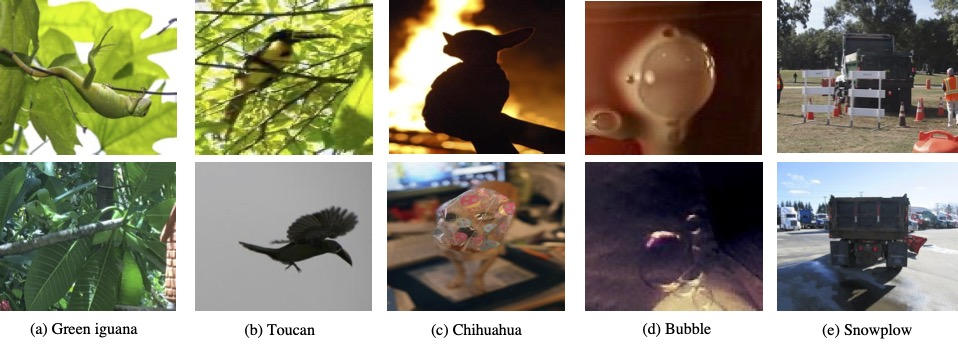

# Rethinking Natural Adversarial Examples for Classification Models

We introduce [ImageNet-A-Plus, a new natural adversarial examples dataset](https://arxiv.org/abs/2102.11731). The new dataset can be used to study the robustness of classification models to the internal variance of objects without considering the background disturbance.

__[Download the natural adversarial example dataset ImageNet-A-Plus here](https://drive.google.com/file/d/1kriPFOkWNBrVe26fQf7xhITm4TXaghev).__

Some examples in ImageNet-A-Plus are shown below:

## Citation

If you find this useful in your research, please consider citing:

    @article{xiaoli2021nae,
      title={Rethinking Natural Adversarial Examples for Classification Models},
      author={Xiao Li and Jianmin Li and Ting Dai and Jie Shi and Jun Zhu and Xiaolin Hu},
      journal={arXiv preprint arXiv:2102.11731},
      year={2021}
    }

